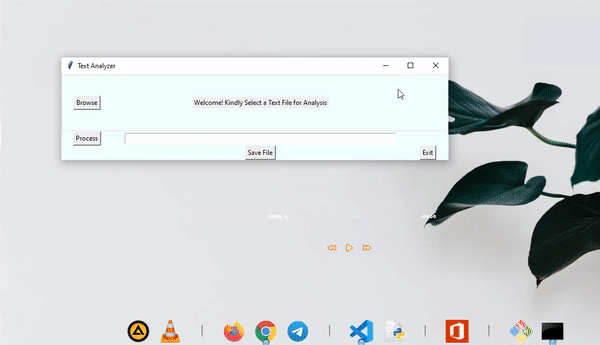

# Text Analyzer


 A graphical User Interface (GUI) tool that conducts a text analysis on a .txt file thats counts:

* total number of words
* total number of occurrences for each word.
* total number of characters in the text document.
* total number of blank spaces in the text document.
* calculate the percentage of blank spaces.


## Badges

## Demo



## Installation

Install my-project using pip package manager to install dependencies in the requirement.txt file                                                                                                                                                                    
run the code
```bash
  pip install -r requirements.txt
```

## Usage
How to process a file and run a text analysis

1. click the Browse button to open a text file from your computer
2. After loading the file, it previews the document by showing few lines
3. click on the process buton to perform analysis on the file
4. A prompt would be displayed that your file has been processed
5. It requires you click n the Save button to save your processed file in the root directory
with an extension of (.textAnalyzed)

## Screenshots


## Roadmap

- Additional browser support

- Add more integrations to make more advanced text analysis

- Improve User Interface design and interactivity


## Authors

- [@myekini](https://github.com/myekini)


## 🛠 Skills
HTML5, CSS3, Bootstrap, Javascript, Python, Django

## License

[MIT](https://choosealicense.com/licenses/mit/)


